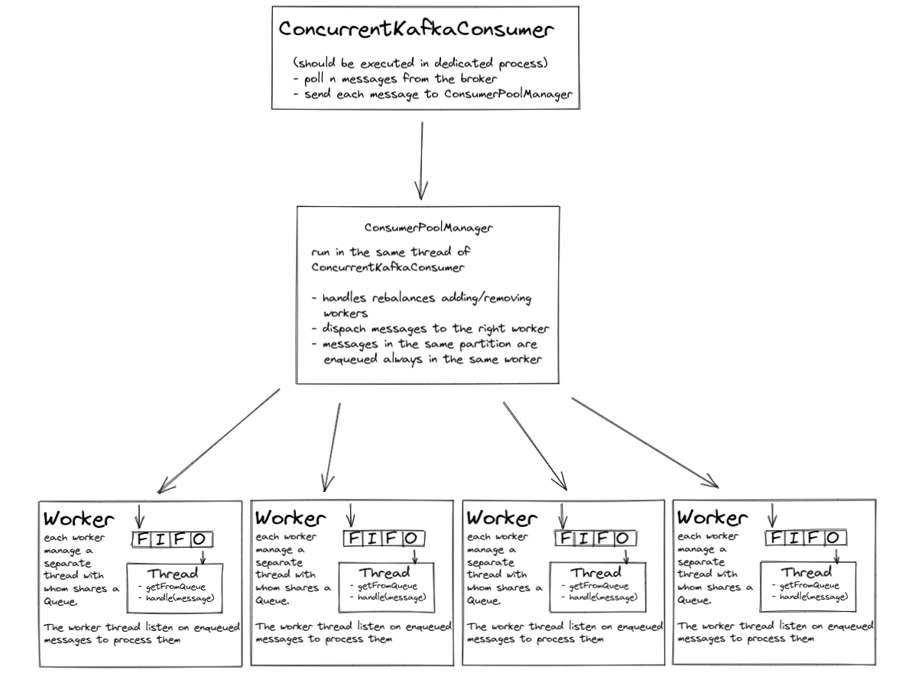

# Python Concurrent Consumer
This is a demo I wrote to setup a Kafka concurrent consumers in Python (using the kafka-python). 

The idea is to have one or more Kafka Consumer running on the same service. 
Each consumer can be started in parallel (multiprocessing) or in concurrency (multithreading). 
Each Consumer is designed to subscribe to a specific topic and each topic's partition is assigned to
worker threads. 

## Run with docker-compose
1) Run `docker-compose up --build` to start all the required containers (Kafka, Zookeeper and the Consumer)
2) Use Kafdrop to monitor the topics status and the consumer lag on `localhost:9000`
3) Open a new terminal and run `python -m producer.producer` to start publishing some messages

## Run locally
1) Run `docker-compose up kafka kafdrop` to start Kafka, Zookeeper. Kafdrop is used to monitor the topics on `localhost:9000`
2) Run `python start_consumer.py --mode concurrent` if you want a multi threaded-based consumer or `python start_consumer.py --mode parallel` if you want to use multiprocessing
3) Open a new terminal and run `python -m producer.producer` to start publishing some messages
